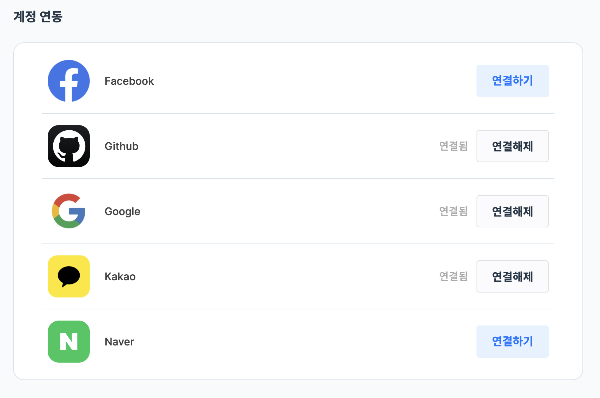

# 🙋‍♀️ Palettee 를 소개합니다!

**Palettee** 는 다양한 업종의 취준생, 협업 재사자의 자기계발을 위한 플랫폼입니다.

<!-- palettee-portfolio-view.png -->

<p align="center">
    
</p>

|                      자신이 작성한 `Archive` 목록                       |                     자신이 작성한 `프로젝트, 스터디 구인글` 목록                      |
|:---------------------------------------------------------------:|:-------------------------------------------------------------------:|
|  |  |

- [Google Drive](https://drive.google.com/drive/folders/1W1UjPxtmu-NRV-IRH9JtyCJ0R8lvZRrE?usp=sharing)

---

## 🚀 **Palettee** 는 다음 기능들을 제공합니다!

<details><summary> ✅ 간편한 소셜 로그인</summary>

> **Palettee** 는 Google 소셜 로그인을 지원합니다.
>
> <!-- examples/login-example.png -->
>
> <p align="center">
>    
> </p>
>
> 비밀번호를 외울 필요 없이 간편히 로그인하세요!

</details>

<details><summary> 🔥 실시간 인기 포트폴리오</summary>

> 현재 사용자들이 많이 조회하는 포트폴리오를 보여줍니다.
>
> <!-- examples/popular-portfolio-example.png -->
>
> <p align="center">
>     
> </p>
>
> 포트폴리오를 게시해서 인기 포트폴리오를 노려보세요!

</details>

<details><summary> 💻 프로젝트 • 스터디 등 자기계발 팀원 모집</summary>

> **Palettee** 를 통해 소중한 팀원을 구해보세요!
>
> |  |  |
> |:------------------------------------------------------------------------:|:------------------------------------------------------------------------:|
>
> **Palettee** 의 `게더링` 게시판을 통해 프로젝트, 스터디, 동아리 등 손쉽게 팀원을 구할 수 있습니다.

</details>

<details><summary> 💬 사용자간 자유로운 채팅</summary>

> **Palettee** 는 사용자간 채팅을 지원합니다!
>
> <!-- examples/chatting-example.png -->
>
> <p align="center">
>     
> </p>
>
> `포트폴리오 첨삭 요청`, `프로젝트 구인 요청` 등 활발한 네트워킹을 시작해 보세요!

</details>

<details><summary> 🥰 실시간 좋아요 알림</summary>

> **Palettee** 는 사용자에게 실시간 알림을 제공합니다.
>
> |  |  |
> |:----------------------------------------------------------------:|:----------------------------------------------------------------:|
>
> 사용자에게 `채팅 요청` 이 들어오거나 게시글에 `좋아요` 가 달렸을 시 알림을 보내드립니다!

</details>

---

## 📑 Project 기술 스택

| 아키텍처                                                                   | 사용한 기술                                               |
|------------------------------------------------------------------------|------------------------------------------------------|
|  |  |

<details><summary> Stacks on Table</summary>

- Application

  |         Name         |                  Description                   |
  |:--------------------:|:----------------------------------------------:|
  |         Java         |                     사용 언어                      |
  |        Gradle        |                     빌드 도구                      |
  |     Spring Boot      |                   프로젝트 프레임웍                    |
  |   Spring Security    |         요청 인증 • 인가 & filtering request         |
  |  Spring Validation   |                    요청 유효 검증                    |
  |        Redis         | Refresh token 저장, Data caching, 채팅 메시지 Pub/Sub |
  |        STOMP         |                 채팅 메시지 broker                  |
  | Spring OAuth2 Client |                     소셜 로그인                     |
  |         JWT          |                 사용자 인증 • 인가 토큰                 |
  |       Swagger        |                   API 문서 공유                    |

- Test

  |    Name     |     Description      |
  |:-----------:|:--------------------:|
  |   JUnit5    |       테스트 프레임웍       |
  | H2 Database |  테스트용 In-memory DB   |
  |   Jacoco    |  테스트 코드 coverage 분석  |
  | Sonar Cloud |       정적 코드 분석       |

- Infra & Monitoring

  |    Name    |              Description               |
  |:----------:|:--------------------------------------:|
  |   Nginx    | Load balancing & Blue/Green deployment |
  | Prometheus |    Collecting server status metrics    |
  |  Grafana   |   Visualizing server status metrics    |
  |  AWS EC2   |           Remote deployment            |
  |  AWS RDS   |             Deployment DB              |
  |   AWS S3   |             Image storage              |

- Persistence

  |      Name       |            Description            |
  |:---------------:|:---------------------------------:|
  |      MySQL      |               RDBMS               |
  | Spring Data JPA | JPA based persistence abstraction |
  |    QueryDSL     |  Supports dynamic query for JPA   |

- CI/CD & Cooperation

  |     Name      |     Description     |
  |:-------------:|:-------------------:|
  |    Docker     | 컨테이너화를 통한 자동 배포에 사용 |
  | Github Action |      CI/CD 사용       |
  |     Slack     |   협업 & 배포 서버 모니터링   |
  |      Git      |        협업 툴         |

</details>

---

## 📌 프로젝트에서 담당한 내용

- [`SecurityConfig`](./src/main/java/com/palettee/global/configs/SecurityConfig.java) 구성
- [`OAuth 2`](./src/main/java/com/palettee/global/security/oauth) 를 통한 회원가입 & 로그인
- [`User` 도메인](./src/main/java/com/palettee/user) 구현
- [`JWT`](./src/main/java/com/palettee/global/security/jwt) 기반 사용자 인증 • 인가

<details><summary> 🔖 부가 수행 내용</summary>

- `SonarCloud`, `Jacoco` 를 이용한 [`CI` 파이프라인](./.github/workflows/ci-with-gradle-and-sonar.yml) 구축
- `Spring Security` `filter`
  우회용 [`BypassUrlHolder`](./src/main/java/com/palettee/global/security/jwt/utils/BypassUrlHolder.java)
  구현
- [`MDC`](./src/main/java/com/palettee/global/logging)
  기반 [도메인별 로그 분리 `logback`](./src/main/resources/logback-spring.xml) 구현

</details>

---

## ✅ 특히 신경쓴 부분

- ### [I. `OAuth 2` 와 `JWT` 통합하기](./assets/docs/OAuth-jwt-integration.md)
- ### [II. Security filter chain 을 우회하는 `BypassUrlHolder`](./assets/docs/BypassUrlHolder.md)
- ### [III. `MDC` 를 이용한 도메인별 로그 분리](./assets/docs/MDC-log-separation.md)

---

## ✨ 프로젝트를 통해 성장한 점

### I. 새로운 지식의 습득

이번 프로젝트를 통해 다양한 기술을 학습하고 접목시키며 백엔드 개발자로서의 역량을 키울 수 있었습니다.
특히 아래의 기술들을 새롭게 익혀 프로젝트에 적용하였습니다.

- `OAuth2 2.0` 의 흐름과 `Spring OAuth 2 Client` 의 활용
- `Redis`, `QueryDSL` 의 기초적 사용법
- `AWS` 배포
- `Logback` 을 이용한 로깅

이들을 통해 `올바른 OAuth 인증은 어떻게 이루어져야 하는지` 알게 되었으며, 기술의 선택과 사용이 서비스 안정성에 얼마나 큰 영향을 미치는지 체감할 수 있었습니다.

---

### II. 안정적인 서비스 운영을 위한 개발

이번 프로젝트는 단순히 기능을 구현하는 것에 그치지 않고 실제 운영 가능한 서비스를 목표로 하였습니다.

때문에 서비스의 기능 개발 후 아래의 부분을 추가하였습니다.

- 개발 실수를 줄이기 위한 `BypassUrlHolder`
- `MDC` `Logback` 을 이용한 로그 분리 및 에러 추적

이들을 통해 지속적으로 개선 가능한 서비스의 기반을 마련하였고, 운영 중 발생한 문제를 쉽고 빠르게 해결할 수 있었습니다.

이번 경험을 통해 `안정적인 서비스 운영을 위한 개발` 의 중요성을 배웠고, 앞으로도 이를 실천해 나갈 계획입니다.

---

### III. `Front` 와의 협업

이번 프로젝트는 제가 처음으로 `Front - Back 협업` 을 경험한 프로젝트였고, 이를 통해 두 가지 중요한 사실을 배웠습니다.

> ### 문서화의 중요성
>
> 프로젝트를 진행하기 전 까지만 해도 `문서화` 란 그저 `까먹지 않기 위해 기록하는 것` 이라 치부했습니다.
>
> 하지만 `Front` 와 협업을 진행하며 문서화는 다른 팀에게 우리 팀의 진행상황을 검증하고 전체 프로세스를 보존하기 위한 것임을 깨달았습니다.

> ### `Front` 개발자의 입장 이해
>
> `Back` 의 입장에서 응답을 보내는 것은 비교적 간단합니다. 각 요청에 맞은 `class` 를 만들어 반환하기만 하 되기 때문입니다.
>
> ```java
> // back 의 입장에선 dataA 에 무엇이 담기는지 중요하지,
> // 'dataA', 'dataB' 등 지칭하는 이름은 그다지 중요하지 않음.
> record Response(
>         String dataA,     // dataA : joon
>         String dataB      // dataB : 010-1234-5678
> )   {}
> ```
>
> 하지만 `Front` 의 입장에서는 속성 이름 하나도 매우 중요한 요소가 될 수 있습니다.
> `Front` 는 일반적으로 `공통 컴포넌트` 를 통해 비슷한 요청들을 처리하기 때문입니다.
>
> 예를 들어 :
>
> ```json
> // 사용자 마이 페이지에서 정보 조회
> {
>   "dataA" : "joon",
>   "dataB" : "010-1234-5678"
> }
> ```
> ```json
> // 프로필 검색에서 정보 조회
> {
>   "name" : "joon",
>   "phone" : "010-1234-5678"
> }
> ```
>
> 위 두 응답은 `Back` 입장에서는 같은 데이터를 반환하고 있지만, `Front` 에서는 공통 컴포넌트로 호환되지 않는 구조입니다.
>
> 이로 인해 `Front` 는 불필요한 코드 중복이 일어나고 재사용성 저하 문제를 겪을 수 있습니다.

이러한 점을 배우며 `Front - Back 협업` 은 어떻게 이루어져야 하는지, 얼마나 자세히 논의되어야 하는지 깨닫게 되었습니다.

이들을 통해 앞으로의 프로젝트에서는 더욱 긴밀한 소통과 체계적인 개발 프로세스를 수립할 수 있도록 노력하겠습니다.

---

## 📝 개선하고 싶은 점

### I. 관리자 metric 기능

관리자 metric 은 서비스 운영자가 `S3 에 저장된 리소스 분석`, `사용자의 bug report 목록`, `사용자별 게시글 작성 유형`, `추방된 사용자` 등을 파악하기
위한 기능을 지칭합니다.

저희는 실제 운영 가능한 서비스를 목표로 하였으나 위 관리자 기능은 설계 당시 생각하지 못했습니다.

프로젝트를 진행하며 위 기능의 필요성을 느껴 구현하였으나 시간상 완료하지 못한 상태입니다.

추후 프로젝트에는 설계 당시부터 위 기능을 고려해 개발하도록 하겠습니다.

---

### II. `ObjectProvider` 이용한 로깅

`ObjectProvider` 란 `Bean scope` 에 따라 올바른 개체를 제공하는 `Spring` 의 클래스입니다.

이전 `MDC 를 이용한 로깅` 을 구현할 당시 `ObjectProvider` 를 몰라 아래처럼 `request uuid` 를 몰래 심어넣어 이용하였습니다.

```java
// 요청별 랜덤 uuid 생성 & 저장
String requestUUID = UUID.randomUUID().toString();
request.

setAttribute("custom-request-uuid",requestUUID);
log.

info("REQUEST {} \"{}\" earned custom UUID : {}",
        request.getMethod(),request.

getRequestURI(),requestUUID);
```

이를 `WEB_SCOPE` 인 `Bean` 과 `ObjectProvider` 를 이용하면 안전하며 직관적인 코드를 만들 수 있을 것 같습니다.

---

### III. 다양한 소셜 계정 통합

실제 `소셜 계정 로그인` 을 지원하는 서비스를 보면 아래처럼 한 계정에 여러 소셜 계정을 묶는 서비스를 제공합니다.

<!-- multi-social-accounts.png -->

<p align="center">
  
</p>

위 서비스를 동일하게 제공하고 싶었으나 이를 위해선 `Spring Security 의 깊은 이해`, `OIDC, OAuth 2 등 대리 인증 방식의 깊은 이해` 가 필요함을
느꼈습니다.

다음 프로젝트를 진행하기 전까지 이들을 공부해 위 서비스를 어떻게 구현할 수 있는지 구체적으로 알아보고 싶습니다.

---

### IV. AOP 를 이용한 [`BypassUrlHolder`](./src/main/java/com/palettee/global/security/jwt/utils/BypassUrlHolder.java) 개선

`BypassUrlHolder` 는 저희가 구성한 `JwtFilter` 를 우회하기 위한 구현체입니다.

그런데 생각해보니 이 대신 `AOP` 를 이용해 해결할 수 있음을 깨달았습니다.

이는 다음 작업들로 인해 해결될 수 있습니다.

> 1. 모든 요청은 `JwtFilter` 를 거칩니다. 다만 `JWT` 가 존재하지 않거나 유효하지 않으면 `Exception` 을 일으키지 않습니다.
> 2. `LoginRequired`, `OptionalLogin` 등 커스텀 annotation 을 구성하고 이를 낚아채는 `Aspect` 를 구성합니다.
> 3. 해당 `Aspect` 에 `Security Context` 의 유저 정보를 확인하는 `Join Point` 를 구성합니다. 
> 4. Annotation 에 따라 유효하지 않을 시 `Exception` 을 발생시킵니다. 

이는 다음의 장점을 야기할 것으로 기대됩니다.

> 1. 더욱 간편한 `SecurityConfig` 구성
> 2. 요청별 일관된 `auth role` 설정 가능
> 3. 관리의 용이성 (변경 & 확장)
> 4. 더 축소된 코드

만약 다음에 `BypassUrlHolder` 처럼 `로그인 여부에 따라 응답을 변경` 하는 기능이 필요하다면 `AOP` 를 이용해 구성하겠습니다.

---
