# 🙋‍♀️ Palettee 를 소개합니다!

**Palettee** 는 다양한 업종의 취준생, 협업 재사자의 자기계발을 위한 플랫폼입니다.

<!-- palettee-portfolio-view.png -->

    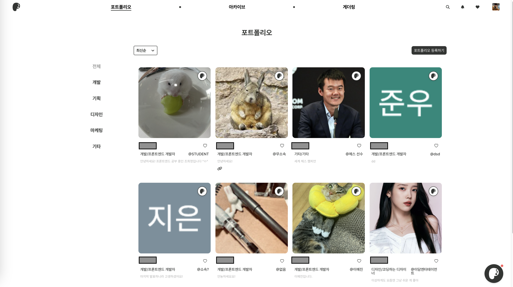

|                      자신이 작성한 `Archive` 목록                       |                     자신이 작성한 `프로젝트, 스터디 구인글` 목록                      |
|:---------------------------------------------------------------:|:-------------------------------------------------------------------:|
| 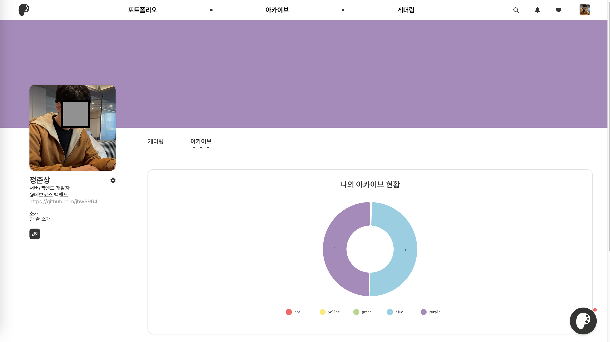 | 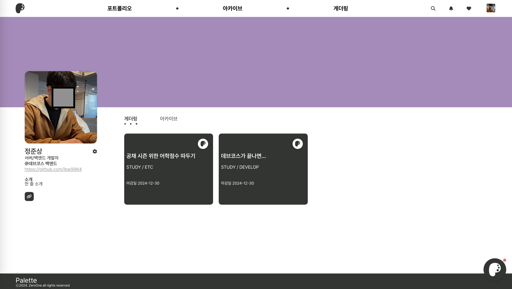 |

---

## 🚀 **Palettee** 는 다음 기능들을 제공합니다!

 ✅ 간편한 소셜 로그인

> **Palettee** 는 Google 소셜 로그인을 지원합니다.
>
> <!-- examples/login-example.png -->
>
> 

>    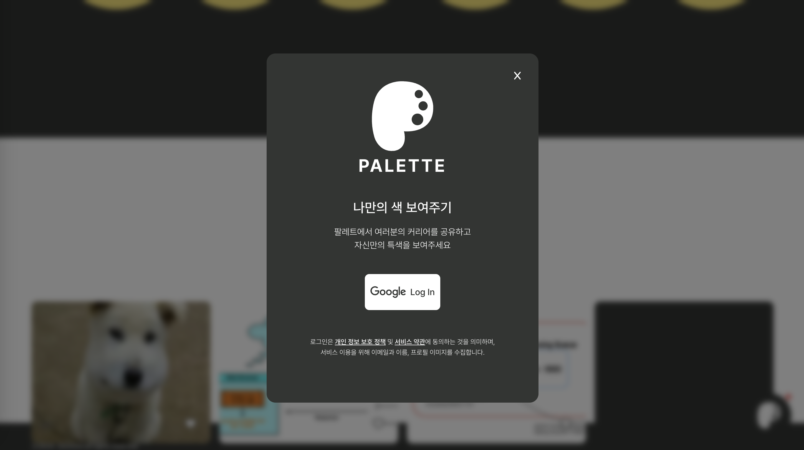
> 

>
> 비밀번호를 외울 필요 없이 간편히 로그인하세요!

 🔥 실시간 인기 포트폴리오

> 현재 사용자들이 많이 조회하는 포트폴리오를 보여줍니다.
>
> <!-- examples/popular-portfolio-example.png -->
>
> 

>     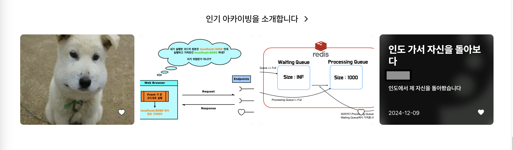
> 

>
> 포트폴리오를 게시해서 인기 포트폴리오를 노려보세요!

 💻 프로젝트 • 스터디 등 자기계발 팀원 모집

> **Palettee** 를 통해 소중한 팀원을 구해보세요!
>
> | 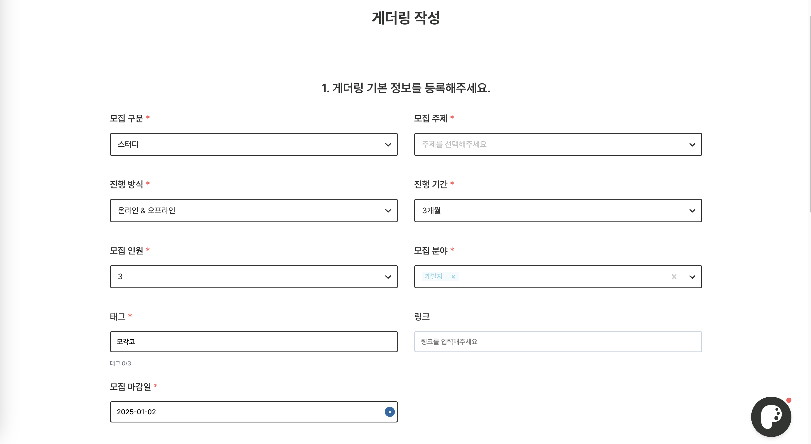 | 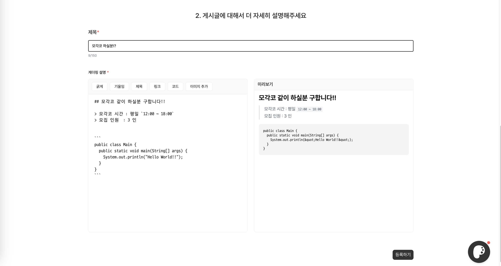 |
> |:------------------------------------------------------------------------:|:------------------------------------------------------------------------:|
>
> **Palettee** 의 `게더링` 게시판을 통해 프로젝트, 스터디, 동아리 등 손쉽게 팀원을 구할 수 있습니다.

 💬 사용자간 자유로운 채팅

> **Palettee** 는 사용자간 채팅을 지원합니다!
>
> <!-- examples/chatting-example.png -->
>
> 

>     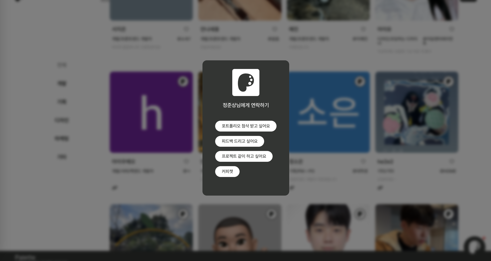
> 

>
> `포트폴리오 첨삭 요청`, `프로젝트 구인 요청` 등 활발한 네트워킹을 시작해 보세요!

 🥰 실시간 좋아요 알림

> **Palettee** 는 사용자에게 실시간 알림을 제공합니다.
>
> |  | 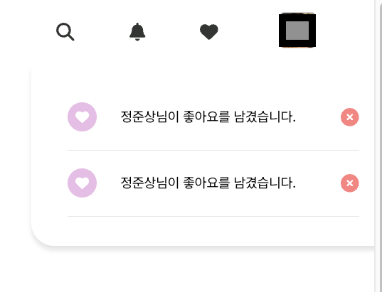 |
> |:----------------------------------------------------------------:|:----------------------------------------------------------------:|
>
> 사용자에게 `채팅 요청` 이 들어오거나 게시글에 `좋아요` 가 달렸을 시 알림을 보내드립니다!

---

## 📑 Project 기술 스택

| 아키텍처                                                                   | 사용한 기술                                               |
|------------------------------------------------------------------------|------------------------------------------------------|
| 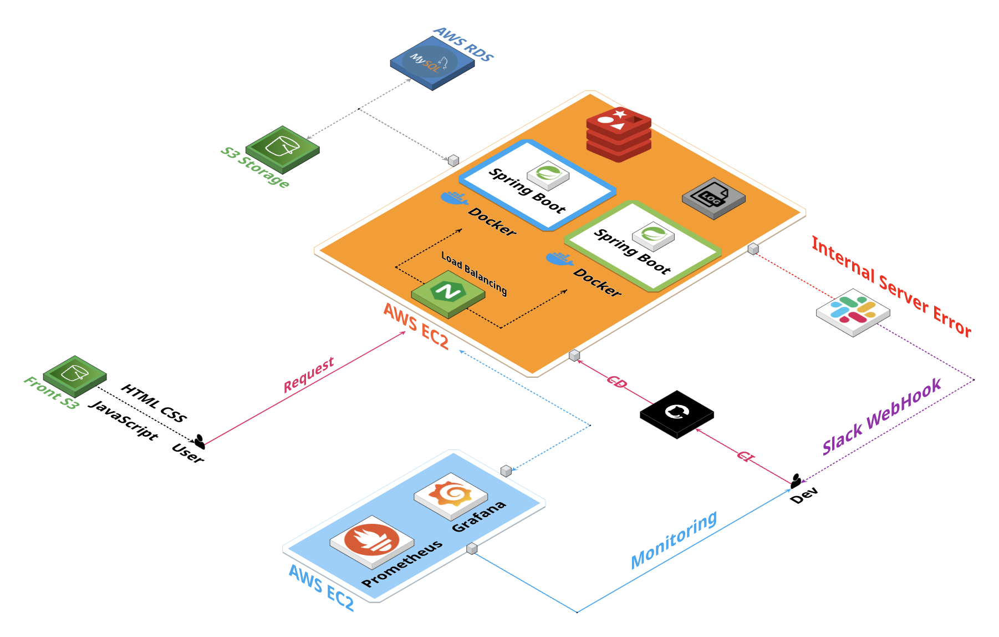 | 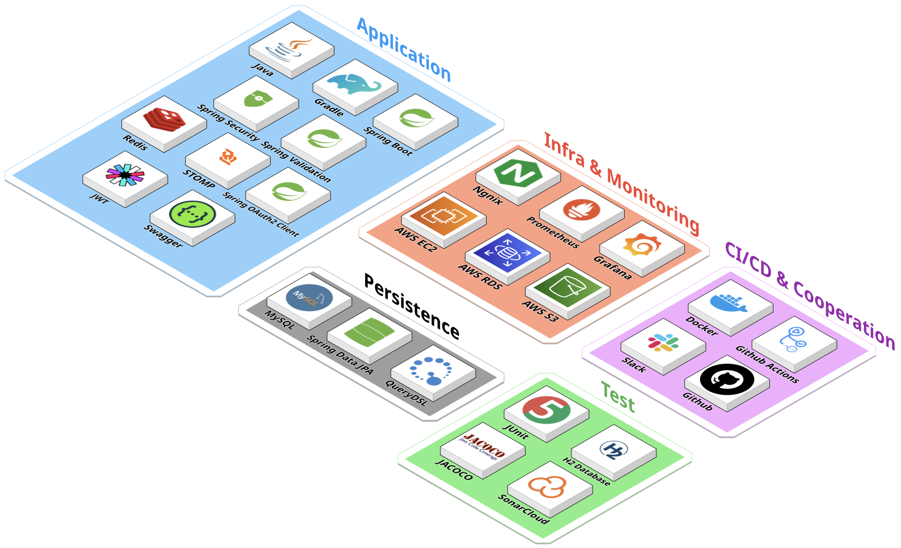 |

 Stacks on Table

- Application

  |         Name         | Description                                    |
            |:--------------------:|------------------------------------------------|
  |         Java         | 사용 언어                                          |
  |        Gradle        | 빌드 도구                                          |
  |     Spring Boot      | 프로젝트 프레임웍                                      |
  |   Spring Security    | 요청 인증 • 인가 & filtering request                 |
  |  Spring Validation   | 요청 유효 검증                                       |
  |        Redis         | Refresh token 저장, Data caching, 채팅 메시지 Pub/Sub |
  |        STOMP         | 채팅 메시지 broker                                  |
  | Spring OAuth2 Client | 소셜 로그인                                         |
  |         JWT          | 사용자 인증 • 인가 토큰                                 |
  |       Swagger        | API 문서 공유                                      |

- Test

  |    Name     | Description        |
    |:-----------:|--------------------|
  |   JUnit5    | 테스트 프레임웍           |
  | H2 Database | 테스트용 In-memory DB  |
  |   Jacoco    | 테스트 코드 coverage 분석 |
  | Sonar Cloud | 정적 코드 분석           |

- Infra & Monitoring

  |    Name    |              Description               |
  |:----------:|:--------------------------------------:|
  |   Nginx    | Load balancing & Blue/Green deployment |
  | Prometheus |    Collecting server status metrics    |
  |  Grafana   |   Visualizing server status metrics    |
  |  AWS EC2   |           Remote deployment            |
  |  AWS RDS   |             Deployment DB              |
  |   AWS S3   |             Image storage              |

- Persistence

  |      Name       |            Description            |
  |:---------------:|:---------------------------------:|
  |      MySQL      |               RDBMS               |
  | Spring Data JPA | JPA based persistence abstraction |
  |    QueryDSL     |  Supports dynamic query for JPA   |

- CI/CD & Cooperation

  |     Name      |     Description     |
  |:-------------:|:-------------------:|
  |    Docker     | 컨테이너화를 통한 자동 배포에 사용 |
  | Github Action |      CI/CD 사용       |
  |     Slack     |   협업 & 배포 서버 모니터링   |
  |      Git      |        협업 툴         |

---

