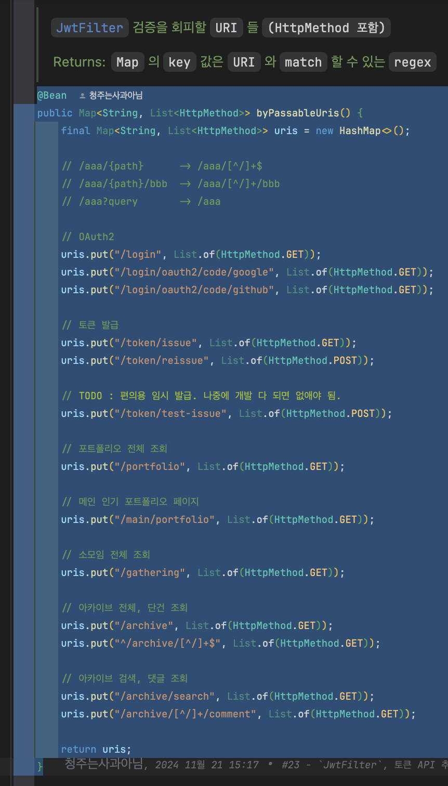
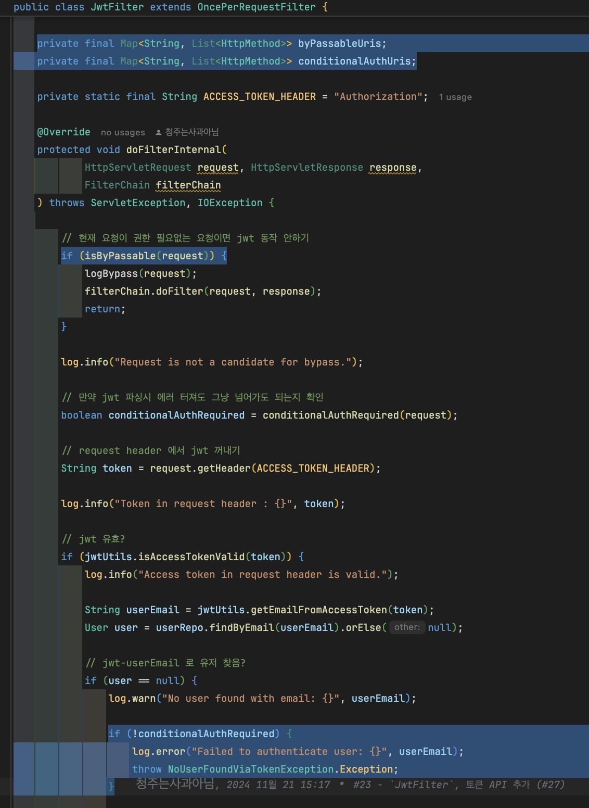
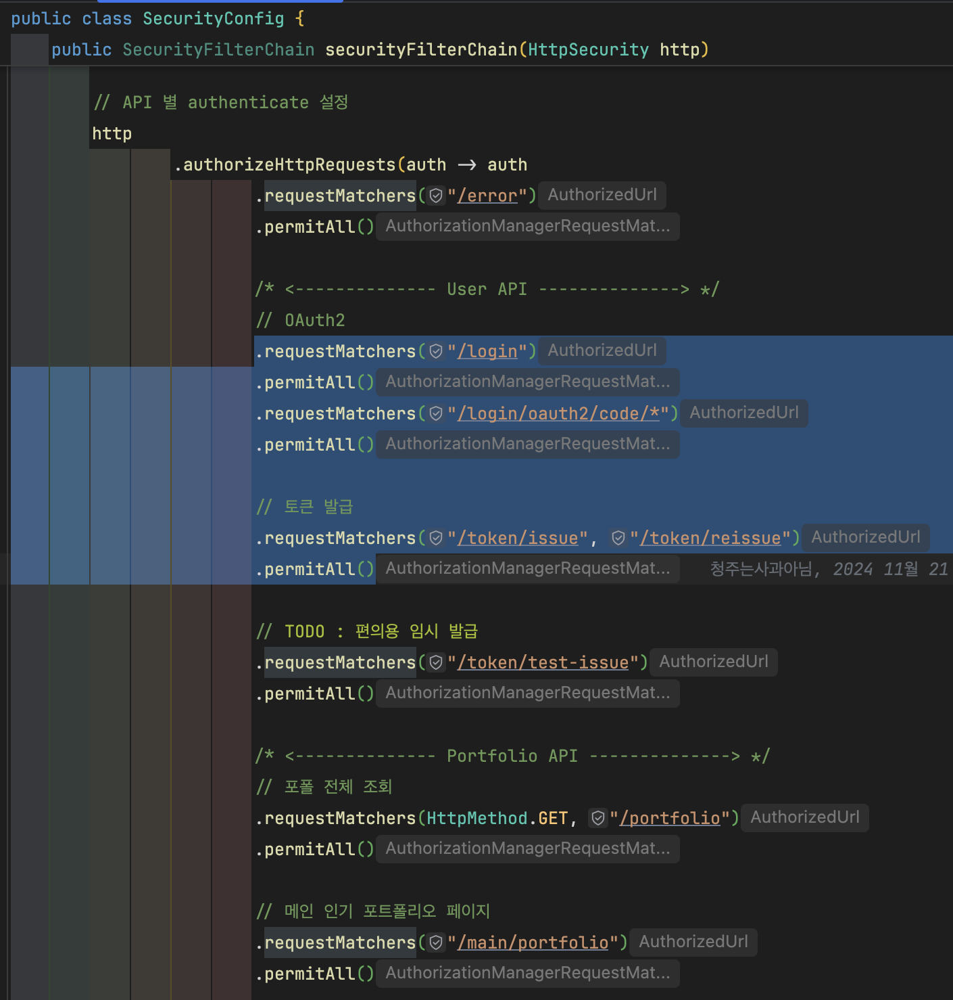
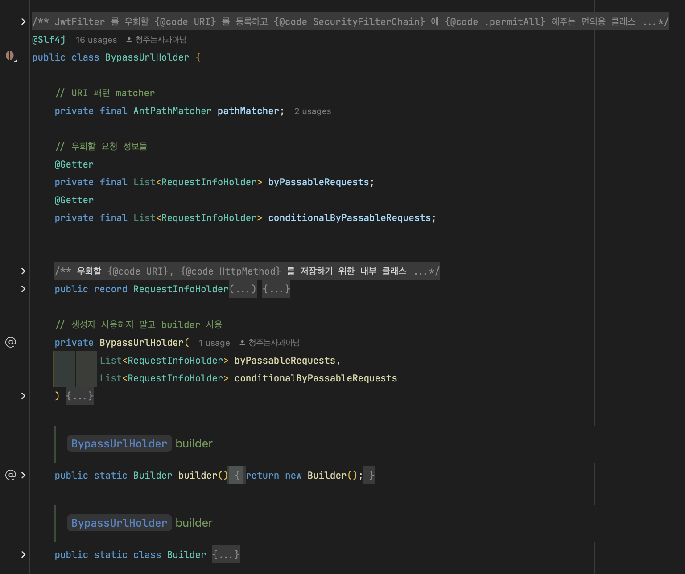
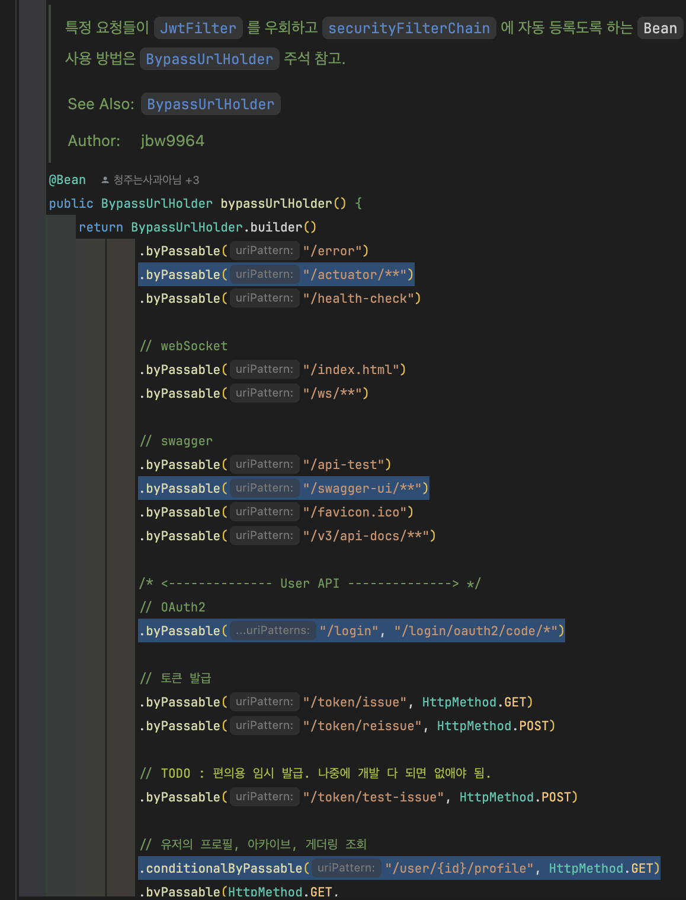
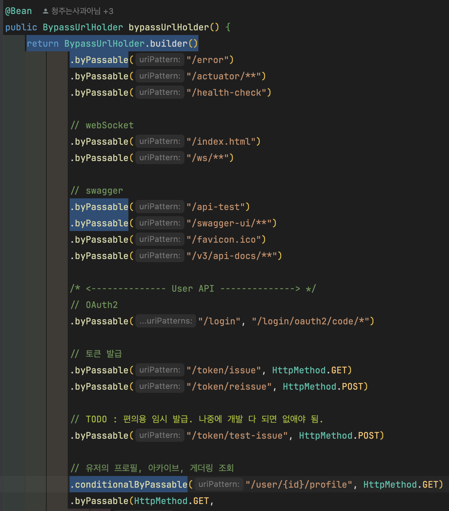
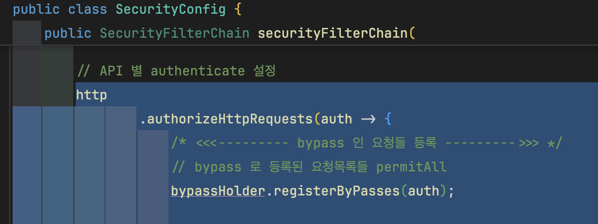
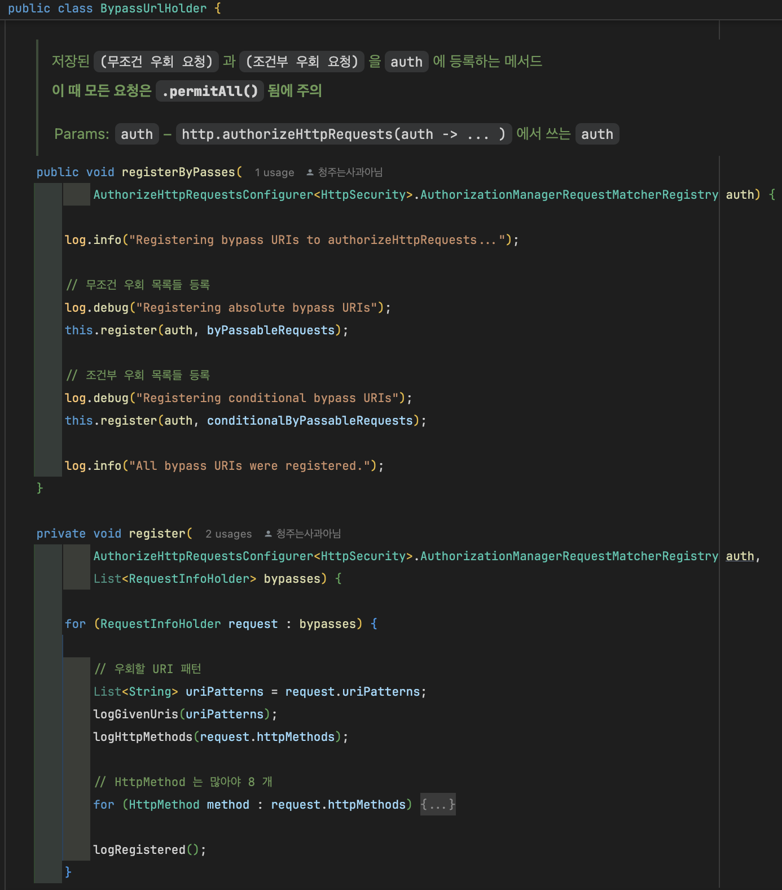
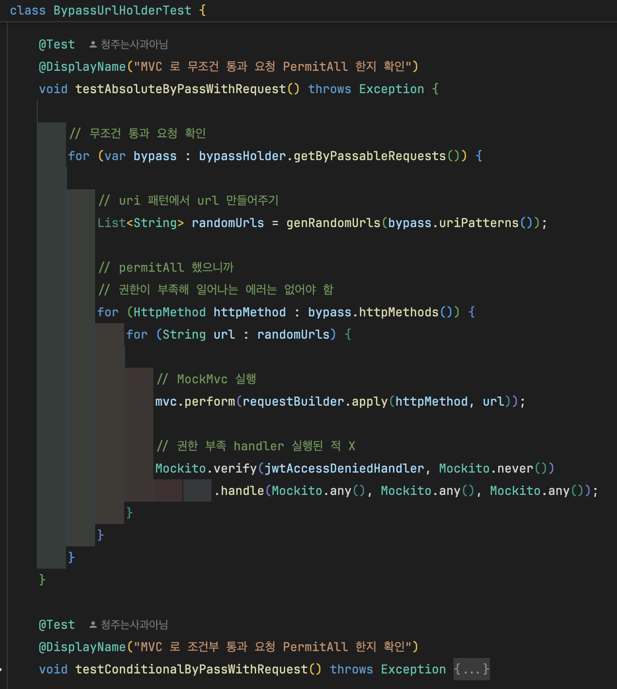

# Security filter chain 을 우회하는 `BypassUrlHolder`

## 문제 개요

저희 서비스의 API 는 `유저 로그인 필요성` 에 따라 다음 3 가지 유형으로 분류됩니다.

- 첫째, `로그인하지 않은 유저` 도 사용할 수 있는 API
- 둘째, 오직 `로그인한 유저` 만 사용할 수 있는 API
- 셋째, `로그인한 유저` 와 `로그인하지 않은 유저` 가 다른 응답을 받는 API

대표적으로 `세번째 유형` 의 예시로 다음 API 들이 있습니다.

|                    | 로그인 X      | 로그인 O                    |
|--------------------|------------|--------------------------|
| **아카이브 조회, 검색 기능** | 아카이브 목록 제공 | 각 아카이브에 자신이 좋아요를 눌렀는지 표시 |
| **특정 유저의 프로필 조회**  | 유저의 정보를 반환 | 자신만 볼 수 있는 정보까지 포함해서 반환  |

이 때 `유저의 로그인 여부` 는 요청 헤더의 `JWT` 를 통해 구별되며, 이를 검증하고 유저 정보를 `Security Context` 에
넣어주는 [`JwtFilter`](../../src/main/java/com/palettee/global/security/jwt/filters/JwtFilter.java) 를
구현하였습니다.

---

## 만족스럽지 못한 임시방편

하지만 기존 `JwtFilter` 에는 `모든 요청에서 JWT 검증을 진행` 하는 문제가 존재하였고, 때문에 `로그인하지 않은 유저 도 사용할 수 있는 요청` 에 `JWT` 검증을
진행해 에러가 발생하였습니다.

이를 빠르게 해결하기 위해 `Map` 을 이용해 아래처럼 임시방편 처리를 진행하였습니다.

| [Prev `SecurityConfig` source code](https://github.com/jbw9964/Palettee/blob/5dedc2159920ac55d1065da7ec0586d062275e3d/src/main/java/com/palettee/global/configs/SecurityConfig.java#L34C5-L77C6) | [Prev `JwtFilter` source code](https://github.com/jbw9964/Palettee/blob/5dedc2159920ac55d1065da7ec0586d062275e3d/src/main/java/com/palettee/global/security/jwt/filters/JwtFilter.java) |
|:------------------------------------------------------------------------------------------------------------------------------------------------------------------------------------------------:|:---------------------------------------------------------------------------------------------------------------------------------------------------------------------------------------:|
|                          `Map`, `Regex` 를 이용해 `JwtFilter` 를 우회하는 `URI` 를 넣는 모습                          |                                     `JwtFilter` 에서 `URI` 에 따라 우회하는 모습                                     |

하지만 이는 말 그대로 임시방편일 뿐 사용하기 복잡할 뿐더러 `SecurityFilterChain`
의 [`요청별 인가 설정`](https://github.com/jbw9964/Palettee/blob/5dedc2159920ac55d1065da7ec0586d062275e3d/src/main/java/com/palettee/global/configs/SecurityConfig.java#L142C9-L221C19)
또한 중복으로 작성해야 되는 구조였습니다.

즉, `Map` 을 이용한 방식은 `Human-error` 가 발생하기 쉽고 저를 제외한 누구도 잘 이해하지 못하는 방식의 코드였습니다.

<!-- security-filter-chain-bypass-before.png -->

     
    우회 요청별 인가 설정을 중복으로 하는 모습

때문에 저는 위 방식에서 벗어난, 사용하기 쉽고 직관적인 방식의 필요성을 느꼈습니다.

그래서 저는 `Builder Pattern` 에 기반한 `BypassUrlHolder` 를 추가하였습니다.

- [`BypassUrlHolder` source code](../../src/main/java/com/palettee/global/security/jwt/utils/BypassUrlHolder.java)

<!-- bypass-url-holder.png -->

    

---

## `BypassUrlHolder` - `Ant Path Pattern` 과 `Builder` 패턴

프로젝트를 진행하며 `Spring Security` 를 이용하다보면 종종 아래와 같은 `URI` 지칭 패턴을 볼 수 있습니다.

|       Pattern       | Description                         |
|:-------------------:|-------------------------------------|
|       `aa/**`       | `**` 를 통해 `aa/` 로 시작하는 모든 URI 를 지칭  |
| `bb/{pathVariable}` | `{...}` 로 path variable 을 지칭        |
|      `cc/*/dd`      | `*` 를 통해 `cc/??/dd` 형태인 모든 URI 를 지칭 |

위와 같은 `URI 지칭 패턴` 을 `Ant Path Pattern` 이라 부릅니다.

`Spring` 은 위 `Ant Path` 패턴 `URI` 를 `resolve` 하기 위해
내부적으로 [`AntPathMatcher`](https://docs.spring.io/spring-framework/docs/current/javadoc-api/org/springframework/util/AntPathMatcher.html)
를 사용하며, 이를 통해 더욱 직관적인 `URI 등록` 을 가능케 합니다.

그래서 저는 `AntPathMatcher` 를 통해 `우회 URI 패턴` 을 `Regex` 방식에서 `Ant Path` 방식으로 개선하였습니다.

<!-- bypass-url-holder-ant-pattern.png -->

     
    Ant Path 패턴을 이용해 우회 URI 를 등록하는 모습

저희 서비스 기능의 특성상 어느 요청은 `반드시 JwtFilter 를 우회` 해야 하고, 또다른 요청은 `선택적으로 JwtFilter 를 우회` 해야했습니다.
이들을 구분하는 것 자체는 어렵지 않지만 이를 `BypassUrlHolder` 에 모두 집어넣다 보니 `BypassUrlHolder` 의 소스코드가 길고 사용하기 어렵다
느꼈습니다.

이러한 상황에선 원칙적으로는 `두 기능을 분리` 하는 것이 올바르지만, 프로젝트 일정 상 명확하게 분리하는 것이 오히려 더 많은 시간을 소비할 것이라 생각했습니다.

하지만 일단은 다른 팀원들이 쉽게 사용할 수 있도록 만들어야 했기 때문에 `Builder` 패턴을 통한 `무조건 우회`, `선택적 우회` 를 등록을 추가했습니다.

<!-- bypass-url-holder-builder-pattern.png -->

     
    Builder 패턴으로 우회 URI 등록, BypassUrlHolder 를 생성하는 모습

---

## `BypassUrlHolder` - 요청별 인가 자동 설정과 테스트 코드

기존 `Map` 방식에서는 우회 요청 `URI` 들의 인가 설정도 하나씩 직접 설정했었습니다. 이는 앞서 말했듯 불편하고 `Human-error` 를 일으키기 쉽습니다.

때문에 `BypassUrlHolder` 에 이를 자동화 시킨 `registerByPasses` 메서드를 구성하였습니다.

|  `SecurityFilterChain` 에서 `BypassUrlHolder` 를 통해 요청 인가를 설정하는 모습 |  `BypassUrlHolder` 의 요청 인가 설정의 내부 작동 |
|:-----------------------------------------------------------------------------------------------------------------------------------------------------------:|:--------------------------------------------------------------------------------------------------------------------------------:|

하지만 이를 자동화한 만큼 위 `요청별 인가 설정` 은 반드시 정상 작동해야 되며, 때문에 이를 확실하게 보여주는 `테스트 코드` 의 필요성을 느꼈습니다.

그래서 `MockMVC` 와 `SpyBean` 을 통한 `요청 인가 설정 테스트 코드` 를 추가하였습니다.

- [`BypassUrlHolderTest` source code](../../src/test/java/com/palettee/global/security/jwt/utils/BypassUrlHolderTest.java)

<!-- bypass-url-holder-test-code.png -->

    

| [`BypassUrlHolderTest` source code](../../src/test/java/com/palettee/global/security/jwt/utils/BypassUrlHolderTest.java) |
|--------------------------------------------------------------------------------------------------------------------------|
|                                             |

이를 통해 직접 구현한 `BypassUrlHolder` 가 정상 작동함을 신뢰할 수 있었습니다.

---

## 개선점

위 `BypassUrlHolder` 를 통해 당장의 급한 문제는 해결할 수 있었지만 몇가지 아쉬운 점이 존재합니다.

> ### 1. `Nested class`, `Builder` 패턴으로 인한 너무 긴 소스코드

`BypassUrlHolder` 를 구현하며 불변성과 사용성을 위해 `내부 클래스` 와 `Builder` 패턴을 이용하였습니다.
하지만 만들고 보니 [`Builder` 패턴으로 인한 코드](https://github.com/jbw9964/Palettee/blob/34cb5eca7224833a3a544f0f50271bd686db8162/src/main/java/com/palettee/global/security/jwt/utils/BypassUrlHolder.java#L141C1-L287C6) 가 100 줄이 넘을 정도로 `Boilerplate-code` 가 많아졌습니다.

물론 일정을 고려해 일부로 `Builder` 를 사용한 것이지만, 너무 긴 코드를 나몰라라 던져둔 것 같아 매우 아쉽습니다.

다음 기회가 있다면 `BypassUrlHolder` 의 기능을 더 세부적으로 분리 설계하는, `SOLID` 에 입각한 설계를 이어나가겠습니다.  

---

> ### 2. `BypassUrlHolder` 를 대체할 `Spring Security` 의 기능 여부 확인

`BypassUrlHolder` 의 목적은 결국 `특정 요청의 JwtFilter 우회` 에 있습니다.
즉, `Spring Security` 에 등록된 특정 filter 를 skip 하기 위한 도구일 뿐입니다.

그래서 사실 `BypassUrlHolder` 를 고안한 시점부터 `Spring Security` 에 위 기능을 제공하지 않을까 생각하였습니다.
하지만 아직 `Spring Security` 에 미숙한 탓에 관련된 기능을 찾지 못하였고, 이 때문에 `BypassUrlHolder` 를 직접 만들게 되었습니다.

따라서 다음 프로젝트 전에는 `Spring Security` 를 깊게 학습하고 `BypassUrlHolder` 를 대체할 기능이 없는지 확인해 사용하고 싶습니다.

---
