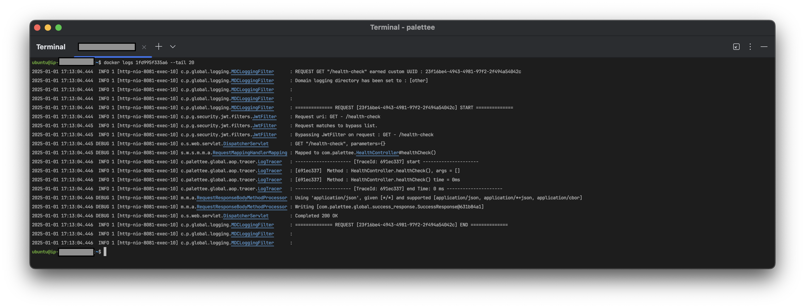
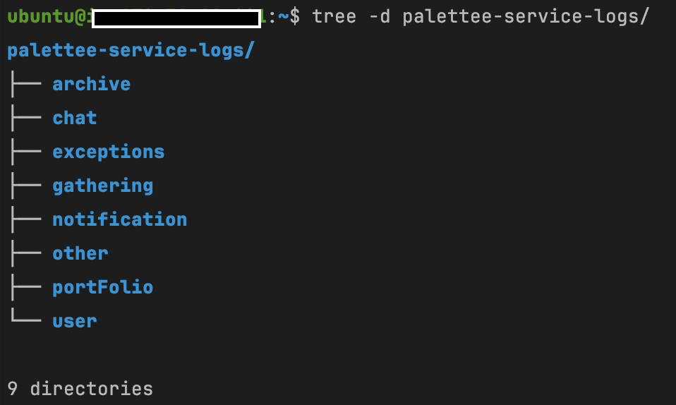
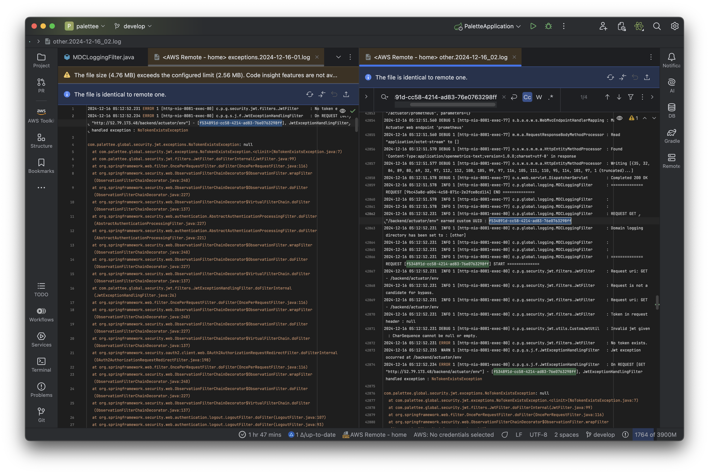

# `MDC` 를 이용한 도메인별 로그 분리

저희 팀은 `Github Action` 과 `Docker` 를 이용한 `CD` 파이프라인을 구추하였습니다.
그런데 실제 배포해 프론트와 연결하다 보니 다양한 에러가 발생하였고, 그 에러를 추적하는데 어려움을 겪었습니다.

`Docker` 로 서버를 올렸기 때문에 `docker logs` 명령어로 로그를 직접 볼 수 밖에 없기 때문이었습니다.

<!-- docker-logs.png -->

<p align="center">
  
</p>

그래서 이를 개선하고자 `Mapped Diagnostic Context` 를 이용한 `요청 도메인별 로그 분리` 를 진행하였습니다.

<!-- mdc-log-separation.png -->

<p align="center">
   
   <br>배포 서버에 도메인별 로그가 저장된 모습
</p>

- [`Source Code`](https://github.com/jbw9964/Devcourse-Final-Project/blob/develop/src/main/java/com/palettee/global/logging/MDCLoggingFilter.java)

   ```java
   /**
    * {@code Mapped Diagnostic Context} 이용한 도메인별 로그 저장(은 아니긴 한데 비슷한) {@code filter}
    */
   @Slf4j
   @Component
   @Order(Ordered.HIGHEST_PRECEDENCE)  // 이러면 filter 중에서도 가장 빠른? 필터로 되는듯. 신기하네
   public class MDCLoggingFilter extends OncePerRequestFilter {
   
       @Override
       protected void doFilterInternal(
               HttpServletRequest request,
               HttpServletResponse response,
               FilterChain filterChain
       ) throws ServletException, IOException {
   
           // 요청별 랜덤 uuid 생성 & 저장
           String requestUUID = UUID.randomUUID().toString();
           request.setAttribute("custom-request-uuid", requestUUID);
           log.info("REQUEST {} \"{}\" earned custom UUID : {}",
                   request.getMethod(), request.getRequestURI(), requestUUID);
   
           try {
   
               this.configureLogDirViaUri(request);
   
               this.logNewLines();
               log.info("============== REQUEST [{}] START ==============", requestUUID);
               filterChain.doFilter(request, response);
   
           } finally {
               log.info("============== REQUEST [{}] END ==============", requestUUID);
               this.logNewLines();
   
               MDC.clear();
           }
       }
   
       // uri 별 도메인 파악해서 MDC key 넣어주기
       private void configureLogDirViaUri(HttpServletRequest request) {
           String uri = request.getRequestURI();
           DomainType domainType = DomainType.of(uri);
   
           MDC.put("DOMAIN_LOG_DIR", domainType.getDomainLogDir());
   
           log.info("Domain logging directory has been set to : [{}]", domainType.getDomainLogDir());
       }
   
       private void logNewLines() {
           log.info("");
           log.info("");
       }
   }
   ```

`MDC` 는 `Mapped Diagnostic Context` 의 약어로 다른 출처를 가진 로그를 편하게 분리시키기 위한 도구 중 하나입니다.

백엔드 서버로 요청이 들어올 경우 `요청별 고유한 UUID` 를 생성 • 저장해 요청의 시작과 끝을 확실히 파악할 수 있도록 구성하였습니다.
또한 요청 처리 중 에러가 발생하면 따로 `exception` 폴더에 집계하도록 하여 에러 추적에 용이하도록 `Logback` 을 구성하였습니다.

<!-- tracing-exception-example.png -->

<p align="center">
   
   <br>배포 로그에서 요청 UUID 를 통해 에러를 추적하는 모습
</p>

이를 통해 원활한 에러 추적이 가능하였고 프론트와의 연결을 마무리할 수 있었습니다.

- [`logback-spring.xml`](https://github.com/jbw9964/Palettee/blob/develop/src/main/resources/logback-spring.xml) : 기본 `Logback` 설정

  ```xml
  <configuration>
  
    <!-- xml 에서 appender 가져오기 -->
    <include resource="logback-appender.xml"/>
  
  
    <!-- ROOT 로그 찍히는거 reference. 솔직히 뭔지 잘 모르겠음. -->
    <root level="INFO">
      <appender-ref ref="CONSOLE"/>
  
      <!--  SQL debug 둬서 쿼리도 잘 찍힘  -->
      <appender-ref ref="PER-REQUEST"/>
    </root>
  
  
    <!-- 우리 모듈에서 error 나는거 reference -->
    <logger name="com.palettee" level="ERROR" additivity="true">
      <appender-ref ref="EXCEPTION"/>
    </logger>
    
  </configuration>
  ```

- [`logback-appender.xml`](https://github.com/jbw9964/Palettee/blob/develop/src/main/resources/logback-appender.xml) : 세부 `Logback` `appender` 설정

  ```xml
  <configuration>
  
    <!-- spring starter logging 에 있는 로깅 패턴 가져오기 -->
    <include resource="org/springframework/boot/logging/logback/defaults.xml"/>
  
    <!-- property 에서 값 읽어오기 : 프로필별 로그 저장 위치 -->
    <!-- 로컬에서는 ./logs, EC2 에서는 ~/logs -->
    <springProperty name="LOG_DIR" source="LOG_DIR"/>
  
    <!-- 오늘 날짜, 로그 패턴 -->
    <timestamp key="TODAY" datePattern="yyyy-MM-dd"/>
  
    <!-- ANSI 적용되는 콘솔용 로그 패턴 -->
    <property name="LOG_PATTERN_CONSOLE"
      value="%clr(%d{yyyy-MM-dd HH:mm:ss.SSS}){faint} %clr(%5p) %clr(${PID:- }){magenta} %clr([%t]){faint} %clr(%-40.40logger{39}){cyan} %clr(:){faint} %m%n%wEx"/>
    <!-- ANSI 코드 없는 그냥 로그 패턴 -->
    <property name="LOG_PATTERN_PLAIN"
      value="%d{yyyy-MM-dd HH:mm:ss.SSS} %5p ${PID:- } [%t] %-40.40logger{39} : %m%n%wEx"/>
  
  
    <!-- 콘솔 로그 보이게 하는 appender -->
    <appender name="CONSOLE" class="ch.qos.logback.core.ConsoleAppender">
      <encoder>
        <pattern>${LOG_PATTERN_CONSOLE}</pattern>
      </encoder>
    </appender>
  
  
    <!-- 요청 domain 별 로그 분리해 저장하는 sifting appender -->
    <appender name="PER-REQUEST" class="ch.qos.logback.classic.sift.SiftingAppender">
      <discriminator class="ch.qos.logback.classic.sift.MDCBasedDiscriminator">
        <key>DOMAIN_LOG_DIR</key>   <!-- 도메인 로그별 폴더 명, MDC 로 설정됨 -->
        <defaultValue>other</defaultValue>
      </discriminator>
  
      <sift>
        <appender name="FILE-${DOMAIN_LOG_DIR}"
          class="ch.qos.logback.core.rolling.RollingFileAppender">
          <rollingPolicy class="ch.qos.logback.core.rolling.SizeAndTimeBasedRollingPolicy">
            <fileNamePattern>${LOG_DIR}/${DOMAIN_LOG_DIR}/${DOMAIN_LOG_DIR}.%d{yyyy-MM-dd}_%02i.log
            </fileNamePattern>
            <maxFileSize>10MB</maxFileSize>
            <maxHistory>14</maxHistory>
            <cleanHistoryOnStart>true</cleanHistoryOnStart>
          </rollingPolicy>
  
          <encoder>
            <pattern>${LOG_PATTERN_PLAIN}</pattern>
          </encoder>
        </appender>
      </sift>
    </appender>
  
  
    <!-- 에러난 부분만 편하게 볼 수 있도록 집계하는 appender -->
    <appender name="EXCEPTION" class="ch.qos.logback.core.rolling.RollingFileAppender">
      <rollingPolicy class="ch.qos.logback.core.rolling.SizeAndTimeBasedRollingPolicy">
        <fileNamePattern>${LOG_DIR}/exceptions/exceptions.%d{yyyy-MM-dd}-%02i.log</fileNamePattern>
        <maxFileSize>5MB</maxFileSize>
        <maxHistory>21</maxHistory>
        <cleanHistoryOnStart>true</cleanHistoryOnStart>
      </rollingPolicy>
      <encoder>
        <pattern>${LOG_PATTERN_PLAIN}</pattern>
      </encoder>
      <filter class="ch.qos.logback.classic.filter.ThresholdFilter">
        <level>ERROR</level>
      </filter>
    </appender>
    
  </configuration>
  ```

---